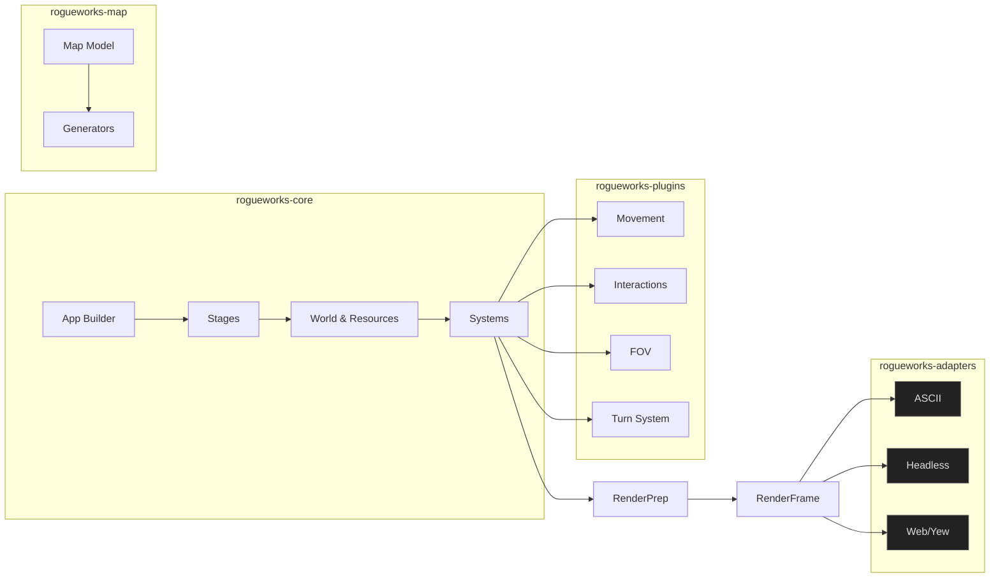

# Architecture

The engine is organized into crates and executed via **stages** on top of Legion ECS.

```mermaid
flowchart LR
  subgraph rogueworks-core
    A[App Builder] --> B[Stages]
    B --> C[World & Resources]
    C --> D[Systems]
  end
  subgraph rogueworks-plugins
    D --> E1[Movement]
    D --> E2[Interactions]
    D --> E3[FOV]
    D --> E4[Turn System]
  end
  subgraph rogueworks-map
    M1[Map Model] --> M2[Generators]
  end
  subgraph rogueworks-adapters
    R1[ASCII]:::ad
    R2[Headless]:::ad
    R3[Web/Yew]:::ad
  end
  D --> RP[RenderPrep] --> RF[RenderFrame] --> R1
  RF --> R2
  RF --> R3
classDef ad fill:#222,stroke:#555,color:#ddd
```
