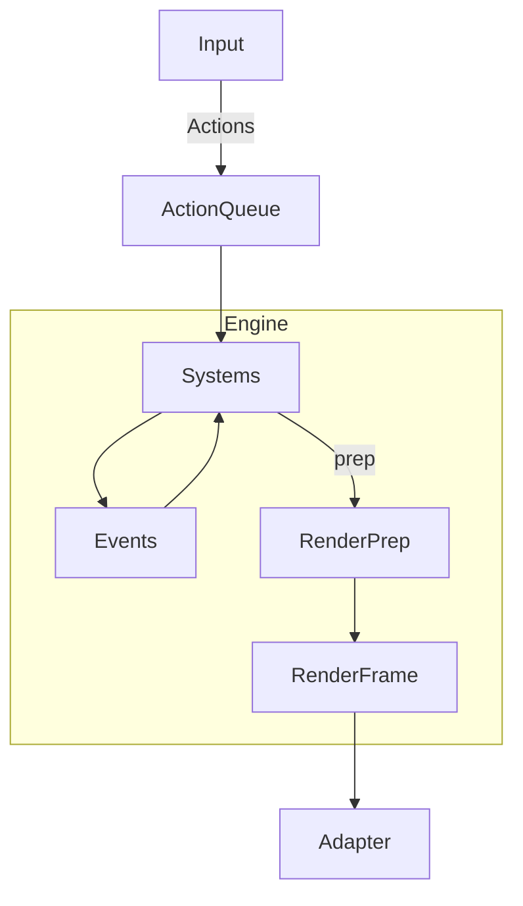

# Rogueworks Design Document (Draft v0.1)

Rogueworks is a modular, extensible roguelike engine written in Rust using Legion ECS.
It provides a reusable foundation for building multiple roguelike projects by abstracting common systems (movement, interaction, map generation, etc.) into optional plugins, while keeping rendering and input adapter-based.

## Philosophy
- Composition over framework
- Deterministic & reproducible (seed-driven RNG)
- Presentation agnostic (render intents)
- Diagnostics first

## Goals & Non-Goals
**Goals:** plugin system, deterministic RNG, abstract rendering, diagnostics/profiling, strong test coverage.  
**Non-Goals:** generic engine for all genres, high-end graphics, multiplayer (for now).

## Architecture (at a glance)

## Modules
- **rogueworks-core:** ECS kernel, plugin API, RNG, events, action queue, render intent prep.
- **rogueworks-map:** Map model, BSP/drunkard walk/CA/prefab generators, validation.
- **rogueworks-plugins:** Movement, interaction, FOV, turn system, AI basics.
- **rogueworks-adapters:** ascii-bracket, headless, web-yew.
- **rogueworks-diagnostics:** tracing, profiler overlay, snapshots.
- **rogueworks-cli:** mapgen CLI, snapshot dump, replay runner.

## Testing Strategy
Unit tests, property tests, integration tests, golden tests, CI with clippy/fmt/wasm.

## Diagnostics
Profiler overlay, tracing spans, event replay, seed logging.

## Roadmap
- Phase 0: Bootstrap (core, RNG, events, headless).
- Phase 1: Maps & Movement (BSP, movement plugin, ASCII adapter).
- Phase 2: Interactions & Diagnostics (interactions, tracing, CLI).
- Phase 3: Stability & Tests (golden tests, docs).
- Phase 4: Extensions (advanced mapgen, web adapter, replay).
